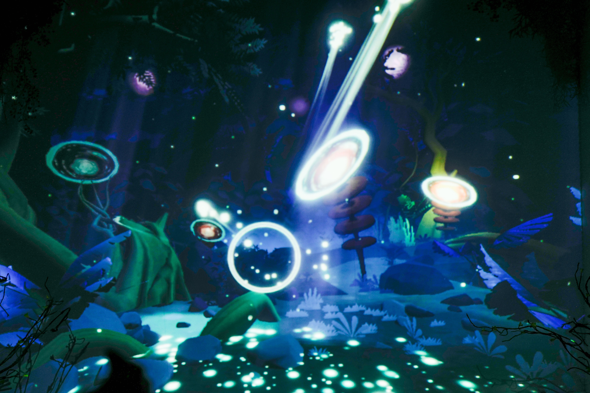
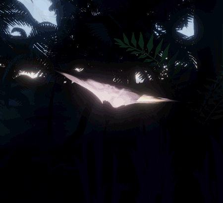

import ImageCard from '../../../src/components/ImageCard'

export const props01 = {
  images : ['https://images.unsplash.com/photo-1494548162494-384bba4ab999?ixlib=rb-1.2.1&ixid=eyJhcHBfaWQiOjEyMDd9&w=1000&q=80','https://images.unsplash.com/photo-1513002749550-c59d786b8e6c?ixlib=rb-1.2.1&w=1000&q=80'],
  caption : 'The caption goes here'
}

export const imgCard02 = {
  images : ["images/img_forest.jpg"],
  caption : ""
}

## Sneak Peek into Pandora 

This installation brings you in to the beautiful night forest of Pandora by letting you interact with the plants in the forest through light transmission. You can deliver light to the plants by swaying above the Leap Motion sensor set up on the table. With enough light, the plants would illuminate, revealing more of the forest.

Please refer [here](https://www.behance.net/gallery/95634201/Peggy-Hartanto-Pandora-Interactive-Storytelling) for more images.

## Concept and Development 

Given an opportunity by the founders of Peggy Hartanto, I worked on this project, covering most of the concept planning and development. Since I was working on this from Japan, I had a huge help from the Bloomingbuds team in setting up the props and beautiful plant decorations.

The content of this installation is built using Unity, and projection-mapped using Touchdesigner. I also created some interactive plants using Blender.

The exhibition lasted for about a month. After spreading the news through Instagram, the store had an average increase of visitors by about 20%.

For more explanation on how I built it, contact me.