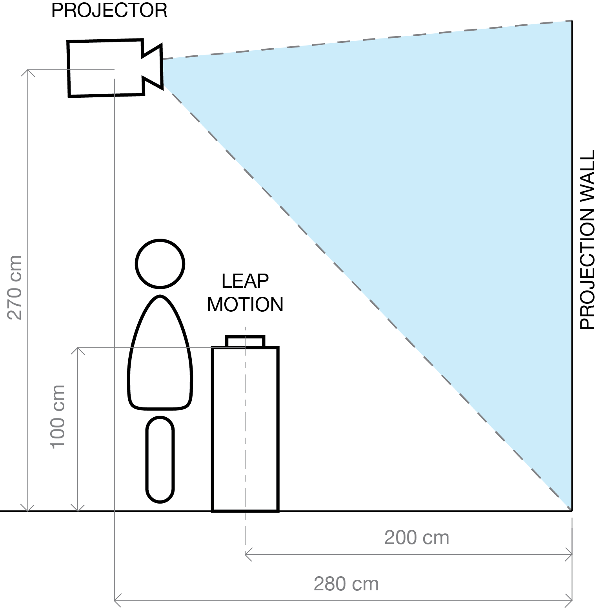

import ImageCard from '../../../src/components/ImageCard'

export const props01 = {
  images : ['https://images.unsplash.com/photo-1494548162494-384bba4ab999?ixlib=rb-1.2.1&ixid=eyJhcHBfaWQiOjEyMDd9&w=1000&q=80','https://images.unsplash.com/photo-1513002749550-c59d786b8e6c?ixlib=rb-1.2.1&w=1000&q=80'],
  caption : 'The caption goes here'
}

<ImageCard {...props01}/>

## Concept

> To immerse visitors to the beautiful night scene of Pandora.

The brand’s seasonal collection was inspired by the vividness of bioluminescent organisms that radiates their beauty at night. We planned to deliver this inspiration to the customers intuitively.  
This led to the decision of an immersive interactive storytelling. 
I chose to use a dark room projection, aiming for "instagram-worthiness" and non-wearable experience. 
Visitors interact by using sensors that would control the bioluminescence of the flora in the scene.

## Interaction Design

I chose Leap Motion as an input device to maintain the level of immersion. 
Placed in the room's center, interaction with this hand-tracking device would feel like magic for those who are new to it. 
Also, the visitor would stay within the proximity of the device to interact, keeping them from breaking the immersion by moving too close to the walls.

#### Experience Scenario

First, visitor enters the room through a curtain and sees Peggy Hartanto's logo lighted up by the projector. The visitor sees a shoe print in front of LeapMotion's table and stands there.
The user sees an instruction to move his hand around on top of the sensor. The scene transitions to Pandora's night scene once the user followed the instruction.
In the night scene, the user swings around their hand again, and light spheres would launch towards the plants in the scene. Certain plants would glow upon contact with these light spheres. After a certain number of plants glow, they would emit particles that further brightens the scene, and a portal would appear around the top side of the scene.
The portal would react if a light sphere is thrown into it, and the scene would transition back to the Peggy Hartanto logo, ending the experience.
Showing the logo first before transitioning to the scene aims to make the visitor relate the night scene to Peggy Hartanto's brand. Another thing that potentially breaks the illusion of depth by contrast is placing an object of interaction close to the virtual camera. I implemented long distance interaction because of that reason.

#### Translating Hand Motion to input

Interaction using Leap Motion can be easily done using Unity. 
In the content, I made a virtual sphere about 30 centimeters above the leap motion. 
If a person's hand enters the sphere, it would launch a light sphere that runs in the same direction as the hand's velocity at that moment. 
The sphere curves to the front, making it easier to target the plants.

## Implementation

#### Visualization

It is said that human experience deeper immersion to digital visualization if there is a high level of black and white contrast. 
So, I chose Epson EB-435, an ultra short throw projector with 3000 lumens. 
Customers generally visit during the day when abundant sunlight enters ARA. 
We built an enclosed room to prevent sunlight from entering in order to maintain good projector contrast.

#### Positioning

Projector was set to be approximately 2.8 meters from the wall with the height of approximately 2.7 meters above the ground. 
This was the minimum distance required to cover one side of the wall entirely. 
The sensor was placed around 2 meters from the projection wall, with the user standing around 20 centimeters behind it. 
Leap motion was placed on a table that is around 100 centimeters high, a height that was enough for average women to raise their hands comfortably above Leap Motion.

#### Software

Content creation was done using Unity, and mapped using TouchDesigner via KlakSpout. 
I used the Stylized Jungle Pack as a basis for the scene, and Amplify Shader Editor for making custom shaders. 

#### Prototyping and Troubleshooting

On the first day, I asked the shop staffs, the designer herself, and her fellow designers to test the installation. 
I discovered that people have different ways to move their hands randomly above leap motion. 
This led them to get the impression that the sensor is insensitive, because the light spheres would not launch the way they want to, where in fact I placed the virtual sphere far from their comfortable reach.

Then, I modified the sphere collider to collide with fingertips at a distance where humans find swinging their hands comfortable. 
After several iterations, I saw more successful attempts and launching the ball, and the user managed to learn how to aim the ball better.

#### Challenges

The challenge during content creation was my lacking skill in modeling and animating 3D objects. 
The plants in this installation needs to be moving organically and illuminate at the same time. 
I used blender for 3D modeling, uv mapping and texture painting.

Another challenge was placing the Projector at the right position and height without using the ceiling and prevent shadow from occlusion. 
This became a challenge because I could not be present on the spot until three days before the installation. 
I had the projector with me so I had to also get the mount to make sure they are compatible.
Ultimately, I finished the setup on the third day, and the installation was ready for release on April 10th, 2019.

## Maintenance

I had to return to Japan way before the installation's closing date, so I prepared a manual and briefed the staffs on the installation.

First, I made a manual on Notion about how to start and end the installation, also about taking care of the projector and leap motion.I also made an emergency restart button in through Unity in case a bug appears. 
As a last resort, I prepared a manual about how to establish Google Chrome Remote Desktop so that I can handle the issue on the computer personally.

## Demo Video

## Lessons Learned

While the installation was successful, I discovered several points that I could have done to improve my overall performance, and in turn, the result.

#### Too careful on minimizing the budget

This prevented me to spend extra money to prepare an early testing environment in Japan for rapid prototyping.

#### Hardware-based expression would have been more effective

Software-based expression involves a lot of programming, which was heavy task for someone that works alone and had tight time limitation.